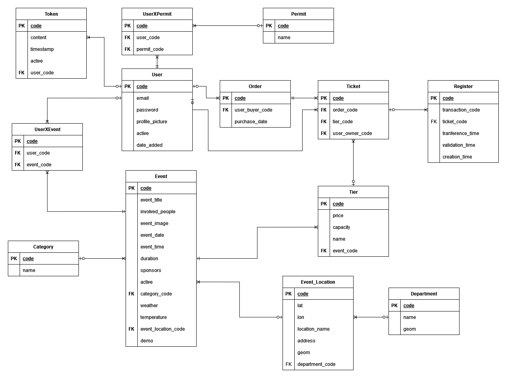
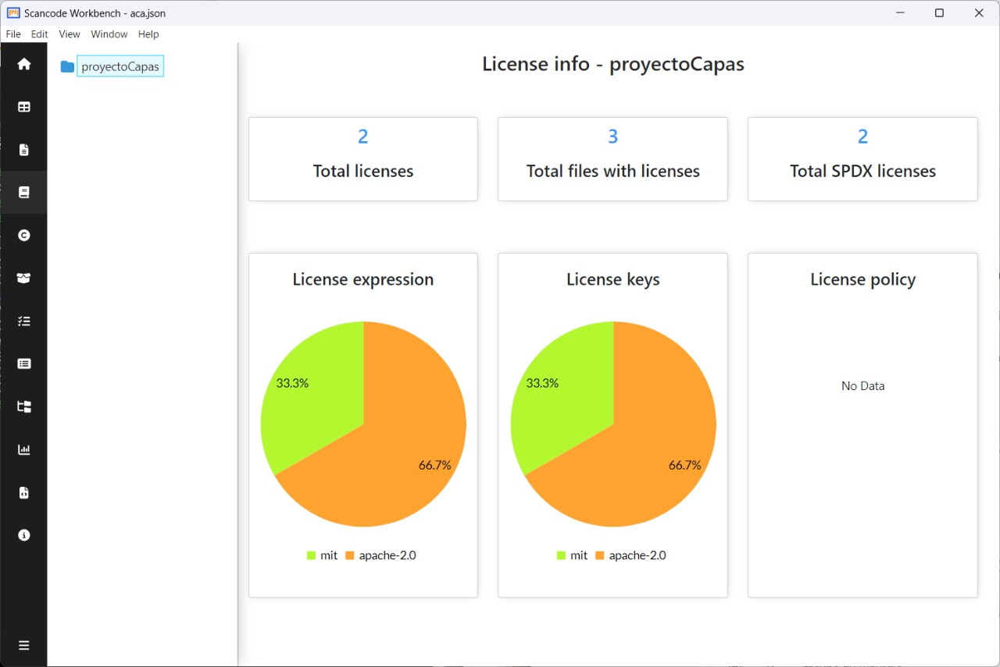

# Manual Técnico de Sistema Guanaco Business

## Índice
 - [Manual Técnico](#Manualtécnico)
	- [Aspectos generales](#Aspectosgenerales)
		- [Objetivos del documento](#objetivos)
		- [Descripción general](#desc)
		- [Tecnologías y prerrequisitos](#req)
 	- [Modelos utilizados](#modelos-utilizados)
		- [Patrón de diseño](#patrón-de-diseño)
		- [Diagrama Relacional](#diagrama-relacional)
	- [Guia de instalación](#guia)
	- [Compatibilidad de licencias](#compatibilidad-de-licencias)
	- [Tipos de error](#tipos-de-error)
 - [Github Issues](#Issues) 
-  [Licencia de código](#Licencia)

# Manual Técnico <a name="Manualtécnico"></a>

 ## Aspectos generales 
 <a name="Aspectosgenerales"></a>

 ### Objetivos del documento  <a name="objetivos"></a>
Este manual técnico está diseñado para ofrecer una descripción exhaustiva y detallada de los diversos elementos y herramientas considerados en la creación del Sistema de Registro de Notas. Su propósito es servir tanto al equipo encargado de su desarrollo como al usuario final que empleará la aplicación.

 ### Descripción general <a name="desc"></a>

Esta aplicación está diseñada para mejorar la experiencia de asistir a eventos, ofreciendo una plataforma integral tanto para clientes como para organizadores y personal de eventos. Los usuarios pueden registrarse, iniciar sesión, y navegar por una amplia gama de eventos clasificados por categorías, además de acceder a funciones específicas según su rol.

- Para los clientes:
	-	Registro e inicio de sesión: Los usuarios pueden crear una cuenta y acceder a ella usando su correo electrónico y contraseña.
	-	Exploración de eventos: Los clientes pueden ver una cartelera de eventos organizados por categoría, así como eventos próximos, facilitando la búsqueda de aquellos de su interés.
	-	Compra de boletos: La aplicación permite la compra de boletos para los eventos deseados de manera segura y eficiente.
	-	Transferencia de boletos: Los usuarios tienen la capacidad de transferir sus boletos a otras personas mediante un código, añadiendo flexibilidad a la gestión de entradas.
	-	Historial de compras y tickets: Los clientes pueden revisar su historial de órdenes y visualizar los tickets adquiridos.

- Para los organizadores y personal de eventos:
	-	Gestión de eventos: Permite la creación y edición de eventos, así como la administración de diferentes niveles de boletos para cada evento.
	-	Asignación de personal: Los organizadores pueden asignar personal a eventos específicos, optimizando la organización y ejecución de los mismos.
	-	Control de accesos: La aplicación ofrece herramientas para otorgar o revocar permisos a los usuarios, así como para validar boletos mediante el escaneo de códigos QR.
	-	Administración de eventos y usuarios: Los responsables pueden deshabilitar eventos y cuentas de usuario según sea necesario.

- Características adicionales:
	-	Implementación de pronóstico de clima en tiempo real.
	Creación de eventos con implementación de ubicación geográfica.
	Poner a disposición del usuario pequeños demos del evento.
	Recomendar al creador del evento precios con base en precios de la zona.

	-	Implementación búsqueda interactiva de eventos en mapa.
	⁠-	Obtener ubicación real del usuario.
	-	Historial de eventos.
	-	Recomendaciones de eventos según gustos.

 #### Esta aplicación permite:
	Para los clientes:
	- Registrarse e Iniciar sesión con correo y contraseña.
	- Ver cartelera de eventos por categoria y eventos proximos.
	- Compra de boletos.
	- Capacidad de transferir boletos a otra persona mediante un codigo.
	- Ver historial de ordenes realizadas.
	- Ver los tickets comprados.
	
	Para los distintos tipos de trabajadores:
	- Creacion y edicion de eventos.
	- Creacion y edicion de tiers de boletos de un evento.
	- Capacidad de asignar personal a eventos.
	- Capacidad de dar y quitar permisos a los usuarios registrados.
	- Validación de boletos mediante el escaneo de codigos Qr.
	- Deshabilitar eventos.
	- Deshabilitar cuentas de usuario.


 ### Tecnologías y prerrequisitos <a name="req"></a>
La aplicación y sus componentes han sido utilizados y desarrollados en entorno local haciendo uso de las siguientes versiones de tecnologías, en el sistema operativo Windows 11. 

#### Base de datos
  * PostgreSQL 14
  * DBeaver

#### Web Service
  * Java Runtime 18
  * Java Spring Boot 3.1.0

#### Cliente Web
  * React 18.1.0
  * Node JS 16.3.0
  * Npm 7.15.1
	
Para la realizacion del cliente web se hizo uso del framework ReactJs, ademas de las librerias de: "axios" para la realizacion de peticiones
al server, "react-qr-code" para la creacion de Qr's, "uuid" para la creacion de codigos para generar sus correspondientes Qr's.

Para la realización del Server se hizo uso de Spring Boot en su version 3.1.0, ademas de las librerias de: Jpa y 
el driver de PostgreSql para manejar base de datos, "Spring Web" para la creacion de controladores web, 
"Spring Validation" para validar la integridad de los datos recibidos del cliente, "Spring Security" para la encriptacion de contraseñas
y asegurar los controladores mediante el uso de autenticacion, "Json Web Token" para la creacion y validacion de Tokens de autenticación.


 ## Modelos utilizados <a name="modelos-utilizados"></a>

 ### Patrón de diseño <a name="patrón-de-diseño"></a>
 
#### Patrón Arquitectónico de Capas

La arquitectura en capas es un patrón de arquitectura software usada en la gran mayoría de sistemas.
Se centra en una distribución jerárquica de las roles y responsabilidades proporcionando una separación efectiva de las preocupaciones 
(cada cual se encarga de lo que le cooresponde).

Capa de presentación (funcionalidad relacionada con la User Interfase)

Capa de negocio (procesamiento de reglas de negocio).También denominada Lógica de Dominio, esta capa contiene la funcionalidad que implementa
la aplicación. Involucra cálculos basados en la información dada por el usuario y datos almacenados y validaciones. Controla la ejecución de 
la capa de acceso a datos y servicios externos. Se puede diseñar la lógica de la capa de negocios para uso directo por parte de componentes de 
presentación o su encapsulamiento como servicio y llamada a través de una interfaz de servicios que coordina la conversación con los clientes 
del servicio o invoca cualquier flujo o componente de negocio.

Capa de datos (funcionalidad relacionada con el accesos a datos). Es donde residen los datos y es la encargada de acceder a los mismos. Está 
formada por uno o más gestores de bases de datos que realizan todo el almacenamiento de datos, reciben solicitudes de almacenamiento o recuperación 
de información desde la capa de negocio.

 ### Diagrama Relacional  <a name="diagrama-relacional"></a>
[](./)

 ## Guia de instalación <a name="guia"></a>

 ### Instalación de base de datos
  Con el objetivo de tener persistencia de datos en nuestra aplicación se debe contar con una base de datos. Para el caso, se utilizará PostgreSQL como gestor de base de datos.

  1. Ejecutar DBeaver e ingresar credenciales de usuario para conectarse. 
  2. Dar clic en ```Servers -> PostgreSQL -> Databases```.
  3. Clic derecho en y luego clic en ```create -> database```.
  4. Dentro del campo escribir el nombre de la base de datos como ```guanaco```. 
  5. clic derecho sobre ```guanaco``` y luego clic en ```query tool```. 
  6. En el campo de texto de ```Query Editor``` pegar todo el contenido de [Database Script.sql](./Data/Database_Script.sql) sustituyendo cualquier contenido existente.
  7. Presionar ```F5``` para ejecutar el contenido de ```Query Editor```.
  8. Repetir los pasos 6 y 7 con [Default_Data.sql](./Data/Default_Data.sql).

### Instalación de servicio Web
1. Modificar el contenido de ```Server/src/main/resources/application.properties``` asignando las credenciales para la base de datos.

### Instalación de cliente web
1. Dentro de la carpeta ``` Client/``` ejecutar el comando ```npm install```.
2. Dentro de la misma carpeta ejecutar el comando ```npm run build```.
3. Dentro de la misma carpeta ejecutar el comando ```npm run dev```.
4. Puede acceder a la aplicación por medio de un navegador consultando la dirección [http://localhost:5173](http://localhost:5173).

## Compatibilidad de licencias <a name="compatibilidad-de-licencias"></a>
[](./)

## Tipos de error <a name="tipos-de-error"></a>

La herramienta "Projects" de GitHub ha sido esencial para organizar y dar seguimiento a cada error de manera estructurada, ya que cada issue se ha creado como una tarjeta en el tablero de proyectos. A cada tarjeta se le ha asignado un título descriptivo, se le han añadido etiquetas relevantes y se ha designado un responsable para su resolución.

Este tablero contiene un registro detallado de todos los problemas y errores encontrados durante el desarrollo y despliegue de la aplicación.

Cada issue se ha creado con el objetivo de proporcionar una descripción clara y concisa del problema encontrado. Esto incluye información relevante como el mensaje de error, el archivo o componente afectado, los pasos para reproducir el error, las causas identificadas y las acciones tomadas para solucionarlo. Además, se ha prestado especial atención a la claridad de los comentarios y soluciones proporcionados en cada issue. Se han utilizado términos comprensibles y se ha explicado el razonamiento detrás de cada solución implementada. Esto se ha hecho con el fin de garantizar que cualquier usuario que encuentre un error en la aplicación pueda entender y seguir las instrucciones proporcionadas en el issue correspondiente.

Es importante destacar que todos los errores documentados han sido solucionados de manera satisfactoria. Los comentarios y soluciones brindados en los issues reflejan los pasos exactos tomados para resolver cada problema y asegurar el correcto funcionamiento de la aplicación. Se ha puesto un énfasis especial en la claridad y la exhaustividad de la documentación, con el objetivo de evitar confusiones y garantizar una experiencia fluida para los usuarios al momento de probar la aplicación.

 ## Github Issues <a name="Issues"></a>
 - Link de Github Issues:
 https://github.com/joshua1535/Guanaquito-Events/issues


 ## Licencia de código  
 <a name="Licencia"></a>
 - MIT License
 [LICENSE](./LICENSE).
